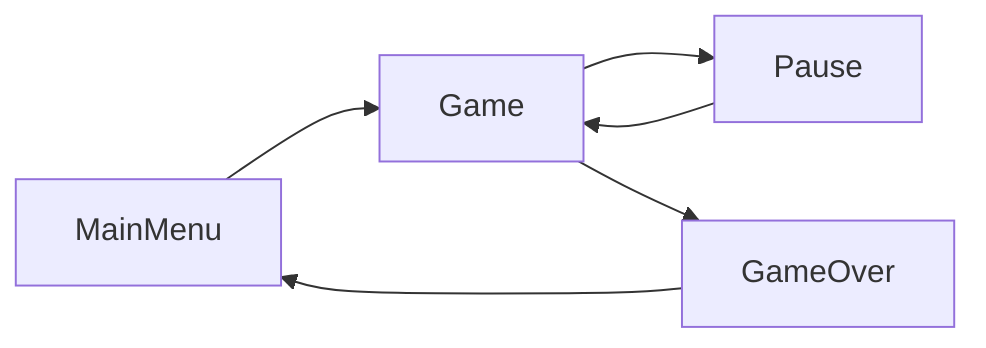

# Diagram Guide

When a diagram is needed, offer to generate. Choose tool based on type.

---

## Option A — Mermaid (Inline)

Use for: inline diagrams that show flow or state transitions. Renders directly in document without export.

Generate directly in document. No export needed.

Confirm nodes and flow with user first.

---

## Option B — matplotlib (Exported PNG)

Use for: diagrams that require custom layout, color styling, or need to be exported as an image.

### Before Generating

Confirm:
- Elements or steps
- Labels, colors, layout
- Output format (PNG default)

### Output Rules

- **180 DPI** for quality
- **White background**, dark text
- No emoji in labels (use plain text)
- Provide as downloadable PNG
